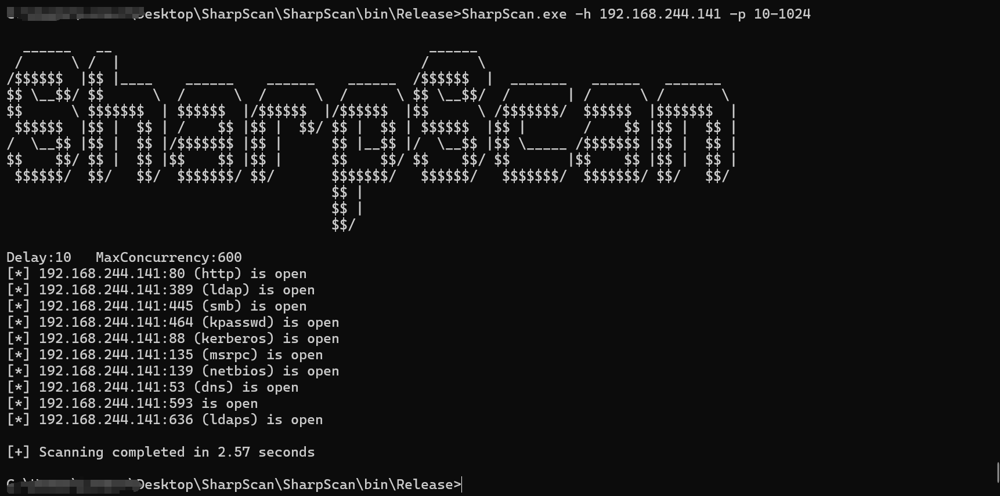
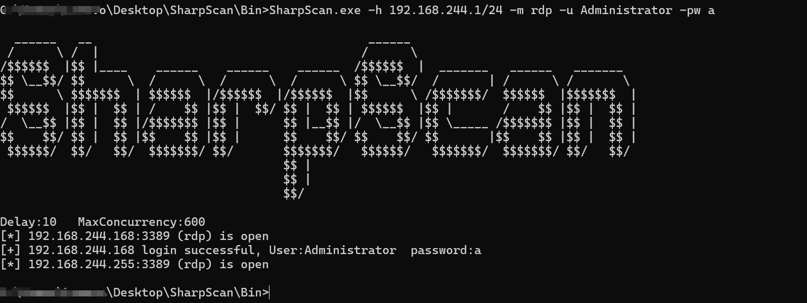
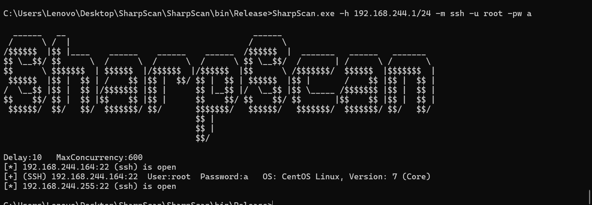
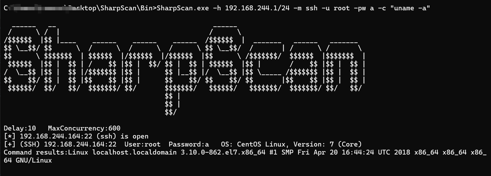
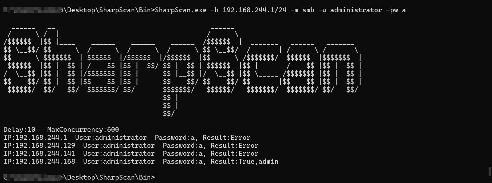
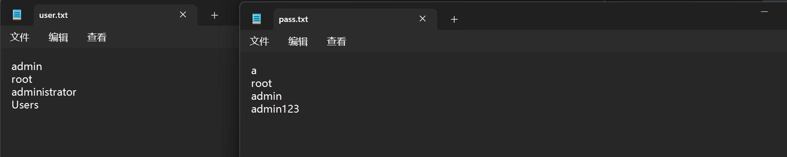
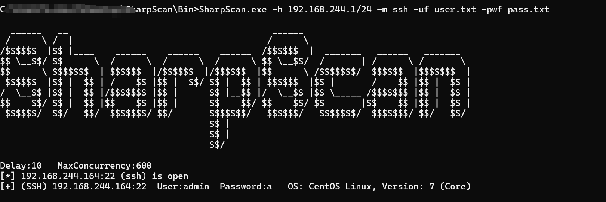
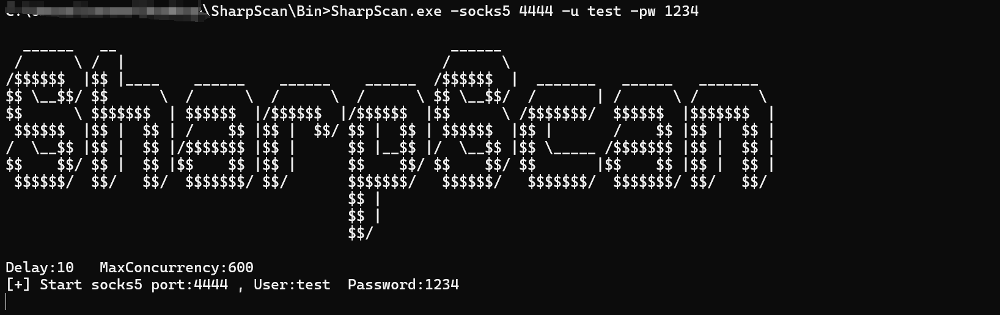
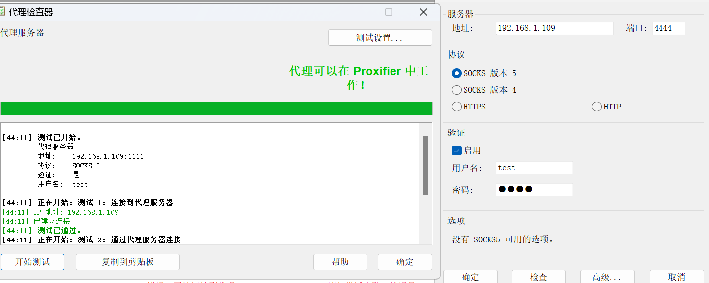
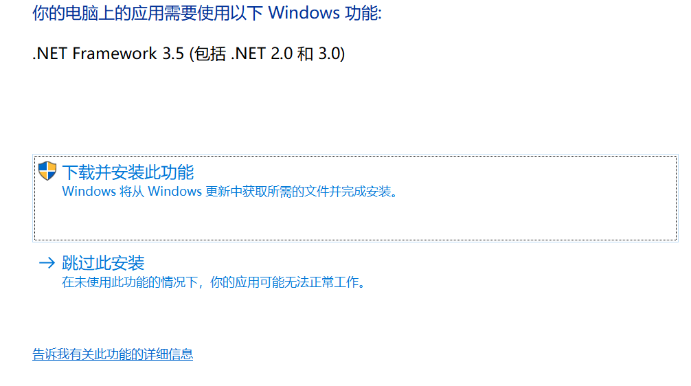

- [1.特点](#1特点)
- [2. 主要功能](#2-主要功能)
- [3.兼容性](#3兼容性)
- [4.使用](#4使用)
  - [4.1基本用法](#41基本用法)
  - [4.2其它功能](#42其它功能)
  - [4.3视频演示](#43视频演示)
  - [4.4截图](#44截图)
    - [端口扫描](#端口扫描)
    - [RDP爆破](#rdp爆破)
    - [SSH爆破](#ssh爆破)
    - [SMB爆破](#smb爆破)
    - [账号密码本爆破](#账号密码本爆破)
    - [全盘搜索](#全盘搜索)
    - [Socks5代理](#socks5代理)
- [5.正在完成(TODO)](#5正在完成todo)
- [6.可能会遇到的问题](#6可能会遇到的问题)
- [免责声明：](#免责声明)
- [参考链接：](#参考链接)


## 1.特点

- C#开发的内网资产扫描器，方便内网横向移动和域内信息收集
- 参考了Ladon，Fscan、Kscan等扫描器的原理
- 为了兼容更古老的系统，所以采用.NET Framework3.5 和.NET Core6.0开发
- 使用异步和高并发、扫描速度快并且可控、内存自动回收
- 用Inline-assembly或者Execute-assembly进行内存加载，实现无文件落地扫描

- 体积较小(目前600kb)、传输快、自动化扫描+内网信息收集一条龙

- 尽量遵循OPSEC原则，不创建额外子进程、不读写注册表等操作


## 2. 主要功能

- 存活探测(Icmp、Arp)
- 端口扫描(Tcp)
- 支持NetBios(默认137端口)、SMB(默认445端口)和WMI(默认135端口)服务快速探测
- 主机信息探测、目标网卡探测
- 高危漏洞扫描：ms17010、CVE-2020-0796(SMBGhost)、ZeroLogon（CVE-2020-1472）
- Webtitle探测，指纹识别常见CMS、OA框架等
- 各类服务弱口令爆破、账号密码枚举(SSH、SMB、RDP)，SSH命令执行
- 探测当前主机.NET版本、操作系统版本信息、杀毒软件/内网设备（AV/EDR/XDR）查询等
- 导出本地RDP登录日志(Rdp端口、Mstsc缓存、Cmdkey缓存、登录成功、失败日志)
- 判断是否在域内、定位域控IP、信息收集域控的FQDN、域管理员组、域企业管理员组、LDAP查询等
- 全盘文件搜索，关键字匹配，与Everything的功能相似，适合全盘检索密码本（静默检索、不消耗内存）
- 携带一个高性能的Socks5代理服务器，支持账号密码验证
- 导出扫描结果


## 3.兼容性

- Windows ：支持win7-win11，windows server2008-2022

- Linux：支持 glibc 2.17以上 的系统

- MacOS： arm x64_x86，intel_x64_86(macOS 10.15以上)

## 4.使用

```powershell
Usage: SharpScan [OPTIONS]

Options:
  -i, --icmp                 Perform icmp scan
  -a, --arp                  Perform arp scan
  -U, --udp                  Perform udp scan
  -h, --hTarget=VALUE        Target segment to scan
  -p, --ports=VALUE          Ports to scan (e.g. "0-1024" or "80,443,8080")
  -u, --username=VALUE       Username for authentication
      --pw, --password=VALUE Password for authentication
      --uf, --ufile=VALUE    Username file for authentication
      --pwf, --pwdfile=VALUE Password file for authentication
  -m, --mode=VALUE           Scanning poc mode(e.g. ssh/smb/rdp/ms17010)
  -c, --command=VALUE        Command Execution
  -d, --delay=VALUE          Scan delay(ms),Defalt:1000
  -t, --thread=VALUE         Maximum num of concurrent scans,Defalt:600
  -s, --search=VALUE         Search all files
      --socks5=VALUE         Open socks5 port
      --nopoc                Not using proof of concept(POC)
  -o, --output=VALUE         Output file to save console output
      --help, --show         Show this usage and help

Example:
  SharpScan.exe -help
  SharpScan.exe -h 192.168.1.1/24
  SharpScan.exe -h 192.168.1.107 -p 100-1024
```

### 4.1基本用法

扫描C段/B段，默认使用所有模块

```powershell
SharpScan.exe -h 192.168.1.1/24  (扫描C段)
SharpScan.exe -h 192.168.1.1/16  (扫描B段)
```

### 4.2其它功能

```powershell
SharpScan.exe -h 192.168.244.1/24 -nopoc                           (只做网段主机探测和端口扫描)
SharpScan.exe -s 192.168.244.169 -p 80-1024 -d 0 -m 600            (Tcp端口扫描:80-1024，0延时，最大并发600)
SharpScan.exe -t 192.168.244.141 -U -p 100-10000                   (udp端口扫描:100-10000，10ms延时，最大并发600)
SharpScan.exe -h 192.168.244.1/24 -m ssh -u root -pw a             (C段ssh服务账号密码爆破,账号root，密码a)
SharpScan.exe -h 192.168.244.1/24 -m smb -u administrator -pw a    (C段smb服务账号密码爆破,账号administrator，密码a)
SharpScan.exe -h 192.168.244.1/24 -m rdp -u administrator -pw a    (C段rdp服务账号密码爆破,账号administrator，密码a)
SharpScan.exe -h 192.168.244.1/24 -m smb -uf user.txt -pwf pass.txt (用账号密码本爆破C段的smb服务)
SharpScan.exe -h 192.168.244.1/24 -m rdp -uf user.txt -pwf pass.txt (用账号密码本爆破C段的rdp服务)
SharpScan.exe -h 192.168.244.1/24 -m ssh -uf user.txt -pwf pass.txt (用账号密码本爆破C段的ssh服务()
SharpScan.exe -h 192.168.244.1/24 -m ms17010                       (C段批量扫描是否存在ms17010)
SharpScan.exe -socks5 8000 -u test -pw 1234                        (Socks5:8000.用户名:test，密码:1234)
SharpScan.exe -h 192.168.244.1/24 -o output.txt                    (将扫描结果导出到output.txt)
```


### 4.3视频演示

[demo](https://private-user-images.githubusercontent.com/89376703/353790871-5b7eb467-ea48-4bd9-9488-1e01e1b35393.mp4)


### 4.4截图

#### 端口扫描

扫描指定IP(默认使用TCP)，端口范围10-1024，0延时，最大并发600，用时3秒

```postgresql
SharpScan.exe -s 192.168.244.169 -p 10-1024 -d 0 -m 600
```




使用UDP协议扫描端口，端口范围100-10000，10ms延时，最大并发600，用时21秒

```powershell
SharpScan.exe -t 192.168.244.141 -U -p 100-10000
```

#### RDP爆破

C段RDP服务账号密码爆破

```
SharpScan.exe -h 192.168.244.1/24 -m rdp -u administrator -pw a
```



#### SSH爆破

C段SSH服务账号密码爆破

```powershell
SharpScan.exe -h 192.168.244.1/24 -m ssh -u root -pw a
```





SSH 命令执行

```
SharpScan.exe -h 192.168.244.1/24 -m ssh -u root -pw a -c "uname -a"
```



#### SMB爆破

C段爆破SMB账号密码爆破：

```powershell
SharpScan.exe -h 192.168.244.1/24 -m smb -u administrator -pw a
```




#### 账号密码本爆破

SSH、SMB、RDP都是同理

```powershell
SharpScan.exe -h 192.168.244.1/24 -m ssh -uf user.txt -pwf pass.txt
```







#### 全盘搜索

搜索本地磁盘上的pass.txt

```powershell
SharpScan.exe -s "pass.txt"
```


#### Socks5代理

使用Socks5服务：在当前主机建立一个Socks5服务，端口为8000，用户名为test，密码是1234

```powershell
SharpScan.exe -socks5 8000 -u test -pw 1234
```






## 5.正在完成(TODO)

- 数据库密码爆破(mysql、mssql、redis、psql、oracle等)
- ftp服务爆破
- redis写公钥或写计划任务
- weblogic、st2、shiro的POC扫描检测


## 6.可能会遇到的问题

1.为什么用NET Framework3.5编写程序

.NET 的语法是向上兼容的，.NET Framework4、4.5、4.8的语法都是可以在3.5和2.0中使用的，但是2.0和3.5的语法无法向上兼容。我在代码中添加了对.NET Framework3.5高级异步和并发的支持，再者3.5以后提供的Linq查询相对于.NET Framework2.0更灵活和高效，因此用.NET Framework3.5编写程序，算的上代码移植性和兼容性比较强的版本。

2.NET Framework3.5不能直接在未安装.NET Framework3.5的windows10、11上运行吗？



很多人遇到这个问题 ，答案是可以的，通过powershell去Patch .NET的版本标识符，将v2.0.50727替换成v4.0.30319，即可在win10上运行，上面说的.net Framework3.5可以直接转成.net Framework4.0以上，因此只需要Patch标识符就行了

```powershell

$filePath = "SharpScan.exe"
$outputFilePath = "SharpScan_Patched.exe"
$findBytes = [System.Text.Encoding]::ASCII.GetBytes("v2.0.50727")
$replaceBytes = [System.Text.Encoding]::ASCII.GetBytes("v4.0.30319")
$content = [System.IO.File]::ReadAllBytes($filePath)
for ($i = 0; $i -le $content.Length - $findBytes.Length; $i++) {
    $match = $true
    for ($j = 0; $j -lt $findBytes.Length; $j++) {
        if ($content[$i + $j] -ne $findBytes[$j]) {
            $match = $false
            break
        }
    }
    if ($match) {
        [Array]::Copy($replaceBytes, 0, $content, $i, $replaceBytes.Length)
    }
}

[System.IO.File]::WriteAllBytes($outputFilePath, $content)

Write-Host "new exe:$outputFilePath"

```

根据这个思路，您可以使用execute-assembly或者inline-assembly去加载.net程序，只需要做到根据判定不同的系统来Patch不同的版本，即可解决兼容性和移植性问题

3.用了内存加载，就可以不用做免杀了吗？

答案是否定的，不管是execute-assembly还是inline-assembly，对于内核级监控的AV/EDR/XDR，C#代码在内存都是透明的，但也不完全是，它们对于.NET的监控更多地是在用户层，因此您需要考虑绕过AMSI，ETW、Ntdll hook，Kernel32 hook等用户层的hook，虽然这看起来有点麻烦，不过C#可以轻松地转成Powershell脚本，通过.NET丰富的混淆方法，可以在应用层和内存中轻松地规避AMSI等引擎的hook


## 免责声明

本项目仅用于渗透测试练习中的教育和研究目的，目前处于测试阶段。禁止将其用于任何非法活动！如果您选择使用此工具，您必须遵守上述要求


## 参考链接

- https://github.com/shadow1ng/fscan

- https://github.com/k8gege/LadonGo

- https://github.com/k8gege/Ladon

- https://github.com/lcvvvv/kscan

- https://github.com/shmilylty/SharpHostInfo

- https://github.com/Adminisme/SharpRDPLog
- https://github.com/3gstudent/SharpRDPCheck


