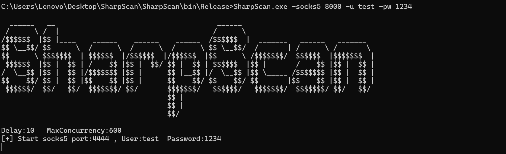

- [1.特点](#1特点)
- [2. 主要功能](#2-主要功能)
- [3.兼容性：](#3兼容性)
- [4.使用](#4使用)
  - [视频演示](#视频演示)
  - [其它功能](#其它功能)
  - [截图](#截图)
- [5.正在完成(TODO)](#5正在完成todo)


## 1.特点

- C#开发的内网资产扫描器，方便内网横向移动和域内信息收集
- 参考了Ladon，Fscan、Kscan等扫描器的原理
- 为了兼容更古老的系统，所以采用.NET Framework3.5 和.NET Core6.0开发
- 使用异步和高并发、扫描速度快并且可控、内存自动回收
- 用inline-assembly或者execute-assembly进行内存加载，实现无文件落地扫描

- 体积较小(目前600kb)、传输快、自动化扫描+内网信息收集一条龙

- 尽量遵循OPSEC原则，不创建额外子进程、不读写注册表等操作


## 2. 主要功能

- 存活探测(Icmp、Arp)
- 端口扫描(Tcp)
- 支持NetBios(默认137端口)、SMB(默认445端口)和WMI(默认135端口)服务快速探测
- 主机信息探测、目标网卡探测
- 高危漏洞扫描：ms17010、CVE-2020-0796(SMBGhost)、ZeroLogon（CVE-2020-1472）
- Webtitle探测，指纹识别常见CMS、OA框架等
- 各类服务弱口令爆破、账号密码枚举(SSH、SMB、RDP)，ssh命令执行
- 探测当前主机.net版本、操作系统版本信息、杀毒软件/内网设备（AV/EDR/XDR）查询等
- 导出本地RDP登录日志(rdp端口、mstsc缓存、cmdkey缓存、登录成功、失败日志)
- 判断是否在域内、定位域控IP、信息收集域控的FQDN、域管理员组、域企业管理员组、LDAP查询等
- 携带一个高性能的Socks5代理服务器，支持账号密码验证
- 导出扫描结果


## 3.兼容性

- Windows ：支持win7-win11，windows server2008-2022

- Linux：支持 glibc 2.17以上 的系统

- MacOS： arm x64_x86，intel_x64_86(macOS 10.15以上)

## 4.使用

```powershell
Delay:10   MaxConcurrency:600
Usage: SharpScan [OPTIONS]

Options:
  -i, --icmp                 Perform icmp scan
  -a, --arp                  Perform arp scan
  -U, --udp                  Perform udp scan
  -h, --hTarget=VALUE        Target segment to scan
  -p, --ports=VALUE          Ports to scan (e.g. "0-1024" or "80,443,8080")
  -d, --delay=VALUE          Scan delay(ms),Defalt:1000
  -t, --thread=VALUE         Maximum num of concurrent scans,Defalt:600
  -u, --username=VALUE       Username for authentication
  -c, --command=VALUE        Command Execution
      --pw, --password=VALUE Password for authentication
      --uf, --ufile=VALUE    Username file for authentication
      --pwf, --pwdfile=VALUE Password file for authentication
  -m, --mode=VALUE           Scanning poc mode(e.g. ssh/smb/rdp/ms17010)
      --socks5=VALUE         Open socks5 port
      --help, --show         Show this usage and help
  -o, --output=VALUE         Output file to save console output

Example:
  SharpScan.exe -t 192.168.1.1/24
  SharpScan.exe -t 192.168.1.107 -p 100-1024
```


扫描C段/B段，默认使用所有模块

```powershell
SharpScan.exe -s 192.168.1.1/24  (扫描C段)
SharpScan.exe -s 192.168.1.1/16  (扫描B段)
```


### 4.1视频演示

[demo](https://private-user-images.githubusercontent.com/89376703/353790871-5b7eb467-ea48-4bd9-9488-1e01e1b35393.mp4)

### 4.2其它功能

```powershell
SharpScan.exe -h 192.168.244.1/24 -nopoc                           (只做网段主机探测和端口扫描)
SharpScan.exe -s 192.168.244.169 -p 80-1024 -d 0 -m 600            (Tcp端口扫描:80-1024，0延时，最大并发600)
SharpScan.exe -t 192.168.244.141 -U -p 100-10000                   (udp端口扫描:100-10000，10ms延时，最大并发600)
SharpScan.exe -h 192.168.244.1/24 -m ssh -u root -pw a             (C段ssh服务账号密码爆破,账号root，密码a)
SharpScan.exe -h 192.168.244.1/24 -m smb -u administrator -pw a    (C段smb服务账号密码爆破,账号administrator，密码a)
SharpScan.exe -h 192.168.244.1/24 -m rdp -u administrator -pw a    (C段rdp服务账号密码爆破,账号administrator，密码a)
SharpScan.exe -h 192.168.244.1/24 -m smb -uf user.txt -pwf pass.txt (用账号密码本爆破C段的smb服务)
SharpScan.exe -h 192.168.244.1/24 -m rdp -uf user.txt -pwf pass.txt (用账号密码本爆破C段的rdp服务)
SharpScan.exe -h 192.168.244.1/24 -m ssh -uf user.txt -pwf pass.txt (用账号密码本爆破C段的ssh服务()
SharpScan.exe -h 192.168.244.1/24 -m ms17010                       (C段批量扫描是否存在ms17010)
SharpScan.exe -socks5 8000 -u test -pw 1234                        (Socks5:8000.用户名:test，密码:1234)
```


### 4.3截图

扫描指定IP(默认使用TCP)，端口范围10-1024，0延时，最大并发600，用时3秒

```postgresql
SharpScan.exe -s 192.168.244.169 -p 10-1024 -d 0 -m 600
```


使用UDP协议扫描端口，端口范围100-10000，10ms延时，最大并发600，用时21秒

```powershell
SharpScan.exe -t 192.168.244.141 -U -p 100-10000
```

C段RDP服务账号密码爆破

```
SharpScan.exe -h 192.168.244.1/24 -m rdp -u administrator -pw a
```


C段SSH服务账号密码爆破

```powershell
SharpScan.exe -h 192.168.244.1/24 -m ssh -u root -pw a
```


C段爆破SMB账号密码爆破：

```powershell
SharpScan.exe -h 192.168.244.1/24 -m smb -u administrator -pw a
```


使用Socks5服务：在当前主机建立一个Socks5服务，端口为8000.用户名为test，密码是1234

```powershell
SharpScan.exe -socks5 8000 -u test -pw 1234
```




## 5.正在完成(TODO)

- 数据库密码爆破(mysql、mssql、redis、psql、oracle等)
- ftp服务爆破
- redis写公钥或写计划任务
- weblogic、st2、shiro的POC扫描检测


## 6.参考链接：

- https://github.com/shadow1ng/fscan

- https://github.com/k8gege/LadonGo

- https://github.com/k8gege/Ladon

- https://github.com/lcvvvv/kscan

- https://github.com/shmilylty/SharpHostInfo

- https://github.com/Adminisme/SharpRDPLog
- https://github.com/3gstudent/SharpRDPCheck


